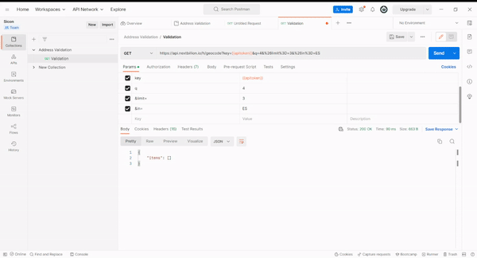

# Introduction Sage200 Address Validation Tool

This app validates than a address is correct. In some cases, customers make mistakes or sometimes staff members input the address manually in their ERP system causing errors. With an address validation tool you can save time and money as it will detect than an address is incorrect before you send it over.

How it works? The app runs X times per day and access to Sage200 database and reads all live Sales Orders. If the delivery address is marked as billing address, it will go to the account and get the billing information. Otherwise it will use the delivery address. Then will send the address data to the third party address validation tool, if the score is 100% (perfect match) the process will end. If the score is below 100% it will send an email, showing that the address is incorrect and in some cases will show an alternative address(sometimes is more than one but better limited). i.e city could be this or postal code this?

If the address is correct but data is in the wrong fields, can I get a different email? Yes, it will send a different email canned response. Sometimes customers/staff input the address in the wrong fields and that could affect shipping integrations as all the data is over the place

Languague: The app is developed in PHP and works with cron jobs.

## Initial

Install the dependencies using composer.json. We recomend use linux and set up a cron job to run the script. (Note. you can use a Raspberry Pi)

1) Go to the folder project and cmd "composer install"  (Note: You will need composer. [here](https://getcomposer.org/download/) )
2) Add your credentials. Go to the folder PHP-> config.php
2.1) Set up email; host_smtp -> your provider, email-> your email, password-> your password, emailto-> which email will receive the notifications (Note. if you are using gmail, you'll need to enable third party apps)
2.2) Set database connection; database-> name of your database, database_user-> your database user, database_pwd-> your database password (Note. this application is using MSSQL but it could be easily configured to use MySQL)
2.3) Set up Api for validation; we tested this app with multiple courier companies but we found that Nextbillion api offers the same at an amazing price. nextbillion_token -> add the bearer token here.

How to automate it? Go to your cron jobs (linux) and set up a job to run the script address_validation_world.php every X times per day

## Database Variables Names

Global Variables

      "UseInvoiceAddress" -> Boolean, if its 0 use Delivery Address and 1 use Billing Address
      "DocumentNo": -> Indicates the Sales Order Number

Delivery Address

      "PostalName"
      "AddressLine1"
      "AddressLine2"
      "PostCode"
      "City"
      "Country"
      "Contact"
      "TelephoneNo"
      "EmailAddress"

Billing Address

      "AddressLine1inv"
      "AddressLine2inv"
      "PostCodeinv"
      "Cityinv"
      "Countryinv"
      "MainTelephoneSubscriberNumber"
      "DefaultEmail"

## Test without database

Go to the folder demo, you'll find a json array sample with 2 scenarios; one using billing address and other using delivery address.

## API used for Address Validation

We used different third party applications and tested the app in some free tools such as UPS address validation tool. For example UPS USA, it is a free tool and works really well but we found a different tool that maybe it is not directly a address validation tool but i can be used as one and covers mostly all the countries in the world. When I requested some quotations, average price were over 1500€ monthly. Next Billion app claims to be free for 100000 api calls, that is more than enough for our project.

For our project we will be using Geocode (Note. You will need to contact them to get a token key)

API Geocode Documentation [here](https://docs.nextbillion.ai/docs/places/api/geocode)

Endpoint: https://api.nextbillion.io/h/geocode

i.e. https://api.nextbillion.io/h/geocode?key={{apitoken}}&q=4 Torrelavega, Miravalles Perfect Score&%26limit%3D=3 &%26in%3D=ES

      {{apitoken}} its the bearer token
      q= its all the address
      &limit= Limit this to 3 max as we need to return address alternatives in case that address is wrong
      &in= Country code or Name

Below is a demo video showing how to test the api using postman.

Other documentation and information below

Main website [here](https://api.nextbillion.io)

API Documentation is [here](https://docs.nextbillion.ai/)

